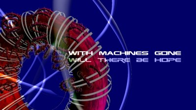

Knot Theory
===========

This is a demo by the Lambda Team for the Experience 2014 party, which came 3rd in the competition.

Song: Ficture - Take Them, (c) Lemongrassmusic

Check out [the video version on YouTube](https://www.youtube.com/watch?v=-qISxjnikJ4).

# Setup

### System Requirements
- OS: Windows/Linux/OSX
- Graphics: OpenGL 3.3 or better

#### On **Linux** install the following libraries.
   i.e. on Ubuntu:
   ```
   sudo apt install libgl1-mesa-dev libxi-dev libxcursor-dev libxinerama-dev libxrandr-dev zlib1g-dev libpulse-dev
   ```
   For other Linux distributions make sure the corresponing packages are installed.

   *These libraries required for OpenGL development.*

#### Compile & Run

To compile you will need [Haskell Stack](https://docs.haskellstack.org/en/stable/README/).

```
stack setup
stack build
stack exec knotTheory
```


